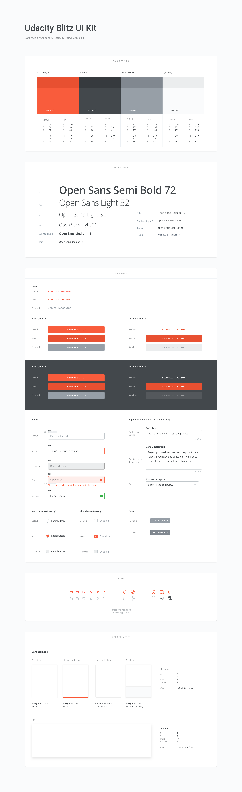

# we-second-project
Second Weekend Project. The Project is about us getting my feet wet into the Bootstrap Framework. The code represents my coding session where I learnt how to use Bootstrap in Website Development. I also found out the ease of development brought by Bootstrap in a frontend project.

### Reference


This is a template that has been taken from [Pinterest](https://www.pinterest.com/pin/566186984394519198/). The author of this beautiful piece of reference is [Szabolcs Bakos](https://twitter.com/wishmylove/).

### Important Additional Information



This is the Udacity UI Kit v2. The image has been taken from [Pinterest](https://in.pinterest.com/pin/441212094730070370/). The author is unknown to me.

### Features

#### LESS / CSS Stuff

- Watches for Less changes on save
- Checks for Less errors and outputs them without you having to rerun Gulp
- Autoprefixes for legacy browsers
- Combines all CSS into one big and sexy minified file
- Includes Less Bootstrap

#### Javascript Stuff

- Automatically compiles all jQuery libraries into one big file JS file
- Lints custom scripts for errors
- Combines all custom scripts into one file

### Build

```
git clone git@github.com:frontend-dev-init/we-second-project.git
cd we-second-project
npm install
gulp
```

### Quick Tips
- Any changes in `assets/less/*` will trigger the Less to compile on save
- All files in `assets/js/libs/*`  will be compressed to `build/jquery.plugins.min.js`
- All files in `assets/js/*` (except for `libs`) will be compressed to `build/scripts.min.js`

These commands build [Less](http://lesscss.org/) code into CSS code. Open [index.html](index.html) file in order to see the webpage.

### Authors
[Kapil Gupta](https://github.com/daemonslayer)

### Template

The base code is from a template called [gulp-and-less-starter-kit](https://github.com/scotch-io/gulp-and-less-starter-kit.git) by [scotch-io](https://scotch.io/). Please check out their other works too. They are awesome.
